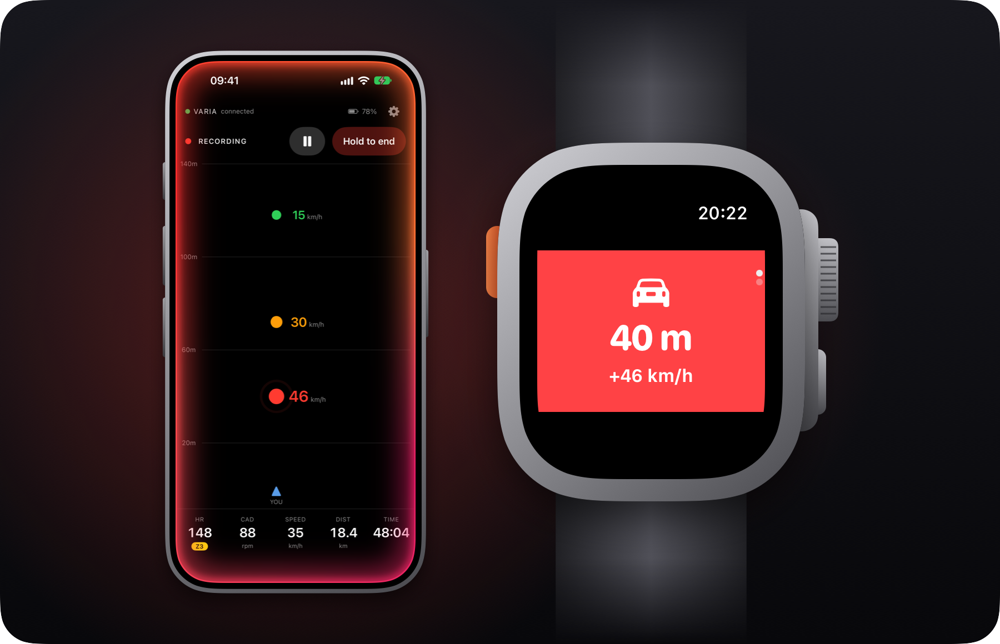
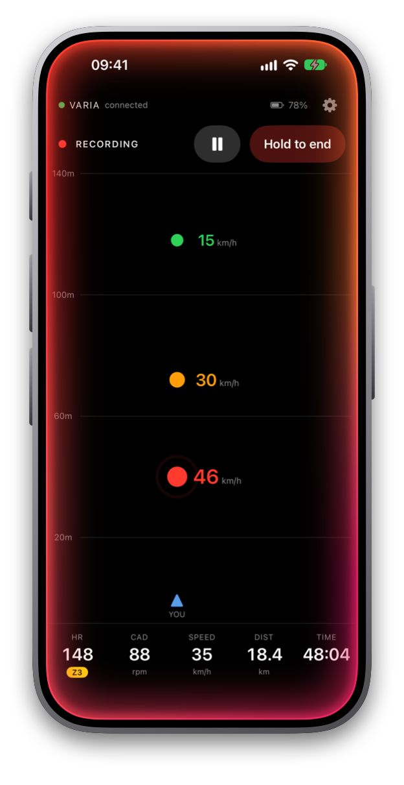
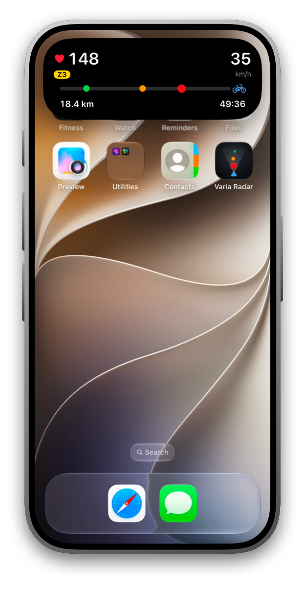
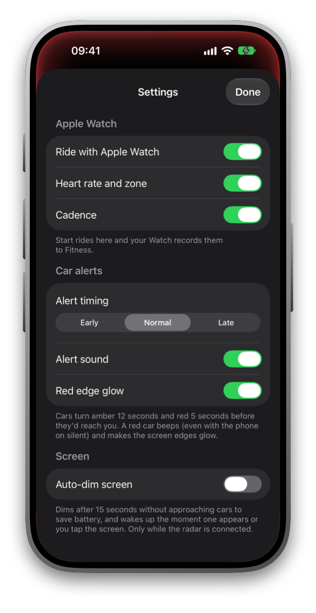
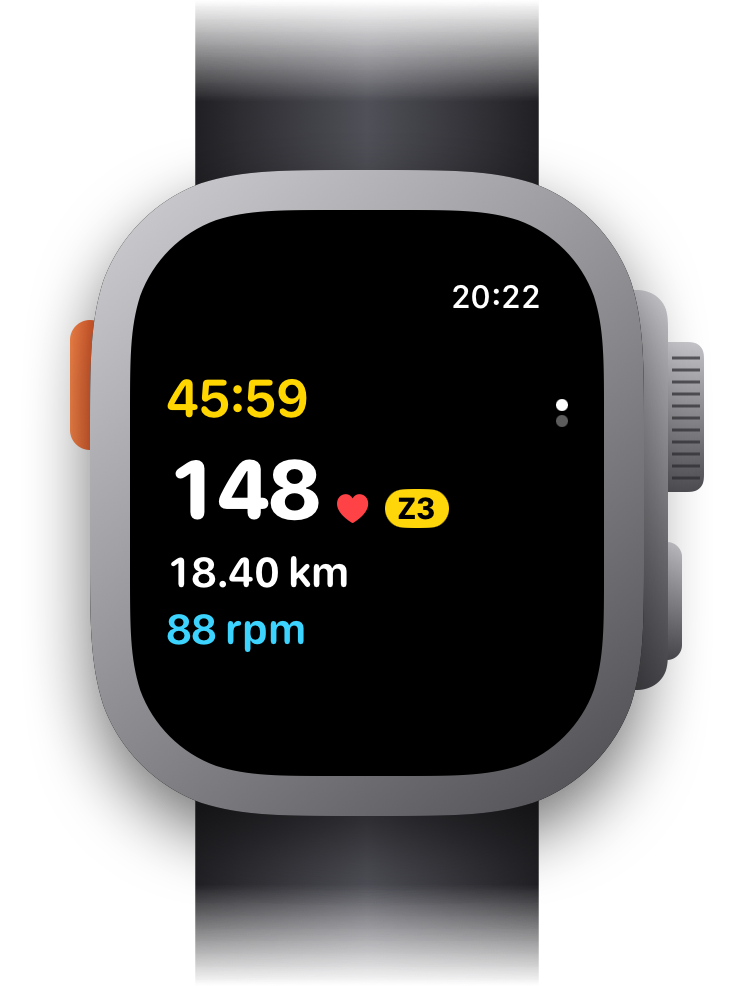
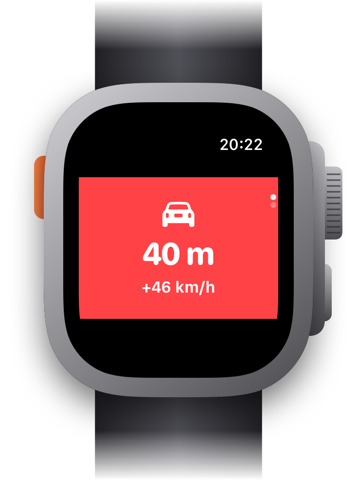

# Varia Radar

<p align="center">
  
</p>

An iPhone and Apple Watch app for riding with a Garmin Varia rear radar (RTL515/516).

- **Radar screen** – cars behind you, coloured by how soon they'd reach you, with their closing speed
- **Apple Watch rides** – live heart rate, zone and cadence on the phone; the ride is saved to Fitness with route, climb and effort
- **Alerts** – a tap on the wrist, a beep, a red glow around the screen edges, and a Live Activity in the Dynamic Island and on the Lock Screen
- **Settings** – radar-only mode, alert timing, sound, glow and auto-dim

Built with [Claude Code](https://claude.com/claude-code) by a first-time iOS developer – see [How it was built](#how-it-was-built).

An independent project, not affiliated with or endorsed by Garmin. Varia is a trademark of Garmin Ltd.

## Screenshots

<table>
  <tr>
    <td align="center"><br><sub>A car closing in fast</sub></td>
    <td align="center"><br><sub>Dynamic Island, from any app</sub></td>
    <td align="center"><br><sub>Settings</sub></td>
  </tr>
</table>

<table>
  <tr>
    <td align="center"><br><sub>The ride on the Watch</sub></td>
    <td align="center"><br><sub>Car alert on the wrist, with a tap</sub></td>
  </tr>
</table>

The screenshots are from the iOS and watchOS simulators, using the app's demo data (see [Making the screenshots](#making-the-screenshots)).

## How it was built

I built this app with [Claude Code](https://claude.com/claude-code), Anthropic's AI coding agent, without having written an iOS app before. The whole project was a conversation:

- **I described what I wanted** – the radar as the hero of the screen, heart rate and zone from the Watch, alerts that still work when the phone is showing something else – and later, what went wrong on real rides.
- **Claude Code did the engineering** – it designed the app and wrote the Swift code for all three parts, generated the Xcode project, ran the builds and fixed the compiler errors, and checked its own UI work in the iOS and watchOS simulators by taking screenshots and tapping through the app.
- **I tested on real hardware** – rides with a Varia RTL515, an Apple Watch Ultra 2 and a Coospo BK467 cadence sensor – and fed back console logs, screenshots and bug reports for the next round of fixes.

Some examples of that loop:

- The Varia's radar data over Bluetooth isn't officially documented. The format was worked out from a console log of a real car passing, from 86 m down to 1 m.
- After the first test ride, the ride's distance and time kept running on the phone after the ride had ended on the Watch. Later the phone sometimes claimed it had lost the Watch after a normal finish. Both came down to how the phone followed the Watch's workout, and were fixed.
- The app icons, the alert sounds and the images in this README are drawn by Swift scripts in `Design/`, written the same way.

The result is about 2,700 lines of Swift in 34 files: an iPhone app, a watchOS app and a Live Activity extension, using SwiftUI, Core Bluetooth, HealthKit, ActivityKit, WidgetKit, Core Location and Core Motion.

## Building

Needs Xcode 27 (iOS 27 and watchOS 27). Open `VariaRadar.xcodeproj` and run the **VariaRadar** scheme on an iPhone.

The Xcode project is generated from `project.yml` by [XcodeGen](https://github.com/yonaskolb/XcodeGen). After changing `project.yml` or adding files, regenerate it:

```sh
brew install xcodegen
xcodegen generate
```

To build under your own Apple account, set `DEVELOPMENT_TEAM` in `project.yml`.

### Making the screenshots

Debug builds have a demo mode. Launched with `-demo` (in Xcode: Product › Scheme › Edit Scheme › Arguments), the iPhone app in the simulator shows three cars, one of them closing in fast, and a Watch ride in progress. The Watch app shows a ride; add `-demoAlert` for the car alert. The screenshots are then framed with:

```sh
swift Design/render-readme-images.swift <screenshots folder> docs/images
```

## Layout

| Folder | What's in it |
|---|---|
| `VariaRadar/` | iPhone app: radar, Bluetooth, GPS, settings |
| `VariaRadarWatch/` | Watch app: records the ride and taps your wrist |
| `VariaRadarWidgets/` | Live Activity for the Dynamic Island and Lock Screen |
| `Shared/`, `LiveActivity/` | Code shared between the targets |
| `Design/` | Scripts that render the app icons, the alert sounds and the README images |
| `docs/images/` | The README images |

The Varia's Bluetooth protocol is documented at the top of `VariaRadar/Radar/VariaBluetoothProvider.swift`.
